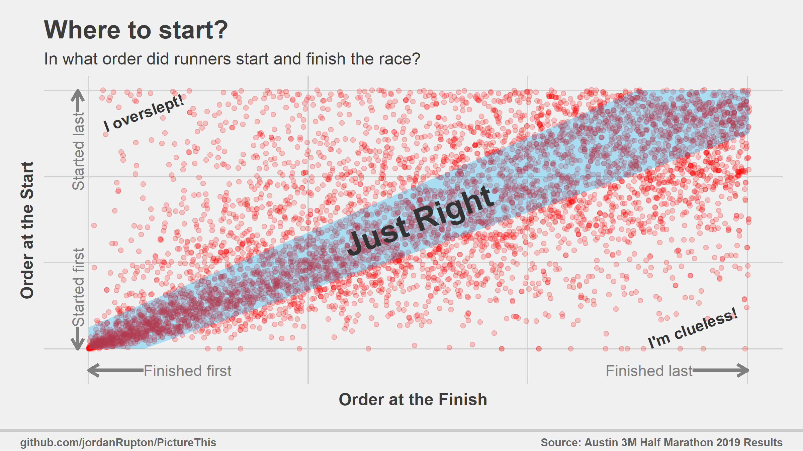

```{r setup, include=FALSE}
knitr::opts_chunk$set(echo = TRUE)
```


I ran in the [Austin 3M Half Marathon](http://3mhalfmarathon.com/) earlier this year.  With over 6000 runners, it was by far the largest race I've run that **didn't** use a wave-start.  That is, everyone started at the same time, and it was up to every individual to place themselves in a position at the start line that was appropriate for their pace.  There were some pacers holding signs to indicate their target times, but other than that there was nothing to guide runners on where to line up in the crowd.

For smaller races like your local 5k, this is not usually a problem.  Even if there are a few kids (or jerks, or jerk kids) who start at the very front, the lead runners will drop them in the first quarter mile.  With 6000 people, if folks don't line up correctly it could lead to chaos & collisions with frustrated fast runners dodging slower runners who started too close to the front.

Fortunately, the start went off very smoothly and analyzing the results can give a good indication why.  With a handful of exceptions, most runners finished the race in *roughly* the same order as they began.  The plot below shows the relationship between start order (determined by the difference between gun time and chip time) and finish order.  The [code.R](code.R) script demonstrates how I generated the plot.

{width=850px}

Now, while everyone who finishes a half marathon should be proud, please don't toe the line if it's going to take you 3+ hours.