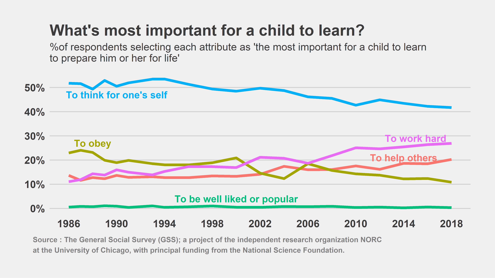

What's most important for a child to learn?
================

The [General Social Survey (GSS)](https://gss.norc.org/) has been asking Americans a wealth of attitude & opinion questions for nearly 50 years. They generously [share their data](https://gss.norc.org/getthedata/Pages/Home.aspx) for free, making it a valuable, if not overwhelming, source of potential analysis.

While scrolling through the over 6000 available questions, I found a set asking what is the most important thing for a child to learn in order to prepare them for life. Respondents were asked to rank the importance of five attributes:

-   To help others
-   To obey
-   To be well liked or popular
-   To think for one's self
-   To work hard

The question has been consistently asked since the 1986 survey, so we've got a full generation's worth of trend to examine. The [code.R](code.R) script demonstrates how I grabbed the data, summarised the responses and generated the plot below.

Thankfully, it seems that practically no one has ever thought being popular was the most important thing a child could learn. The importance of learning to obey has fallen out of favor since the 80's, though interestingly the proportion of those selecting "thinking for one's self" has dropped by about the same amount. While it's still the most popular response, fewer Americans are placing emphasis on independent thinking. Instead, working hard and helping others have risen from relative obscurity to the attribute of choice for 27% and 20% of Americans, respectively.

If anyone needs me, I'll be working hard on helping others get popular.
