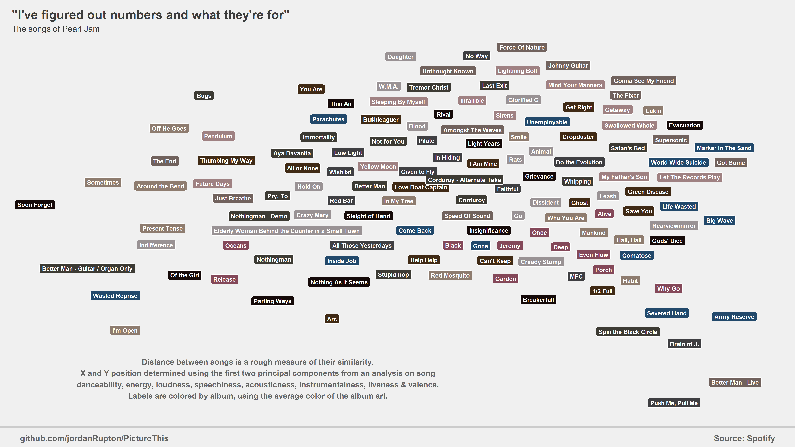

```{r setup, include=FALSE}
knitr::opts_chunk$set(echo = TRUE)
```

I'm a big Pearl Jam fan, though that term is a bit of a [rabbit hole](https://xkcd.com/1095/).  Surely, I thought, there must be a way to combine my love of Pearl Jam with my love of data visualisation.  Surely, I have nothing better to do!

Fortunately, Spotify has an [open API](https://developer.spotify.com/my-applications/#!/applications) that allows users to extract data not just on artists and songs but also provides some proprietary metrics such as 'danceability', 'energy' and 'loudness'.  Even better, there's already [an R package](https://cran.r-project.org/web/packages/spotifyr/spotifyr.pdf) that makes it easy to work with the API.

I pulled Spotify's metrics for the 134 songs in Pearl Jam's studio catalog and ran them through a [principal component analysis](https://en.wikipedia.org/wiki/Principal_component_analysis) (PCA).  PCA allows us to take a large number of metrics and "compress" them into a smaller number of metrics which retain much of the same information as the original.  It's sort of like a shadow of our data; not exactly like the original, but still enough for us to get an idea of what it looks like.

I used the first two resulting principal components (which accounted for 59% of the total variance) to generate a scatterplot of the songs.  Each song was then color-coded by album, using the average color that appeared on that album's cover art.  The [code.R](code.R) script demonstrates how I pulled the data and generated the plot below.

{width=850px}

The distance between the songs is a rough measure of how similar they are, at least in terms of Spotify's metrics.  For example, the far left contains a lot of softer, slower tunes.  To the top and right are some of the group's more pop-rock numbers while the bottom right contains some real hard, sometimes depressing stuff.  It's interesting to see how clustered most of the songs from 'Ten' are, and how much they've expanded their sound since then.

If nothing else, this confirms my long-held suspicion that 'Push Me, Pull Me' is just weird.